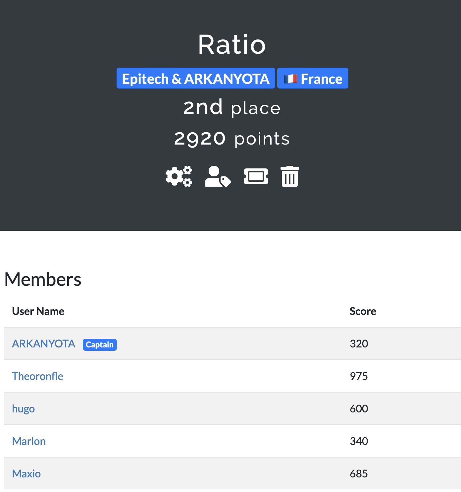
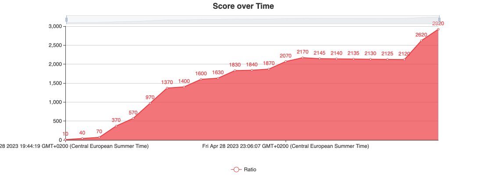
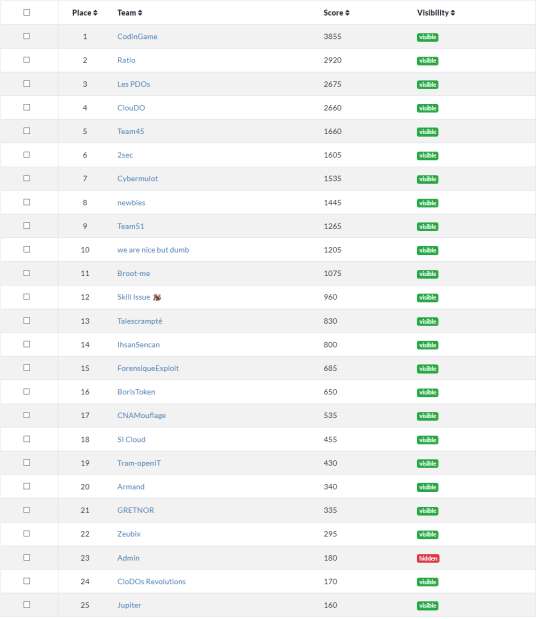

# CTF OPENCYCOM 2023

2ème du CTF sur 25 équipes

## Authors

- [Maxim](https://github.com/MaximCosta)
- [Théodore](https://github.com/TheodoreBillotte)
- [Marlon]()
- [Nolan](https://github.com/ARKANYOTA)

## Classement

## Résultats

## Classement entier

